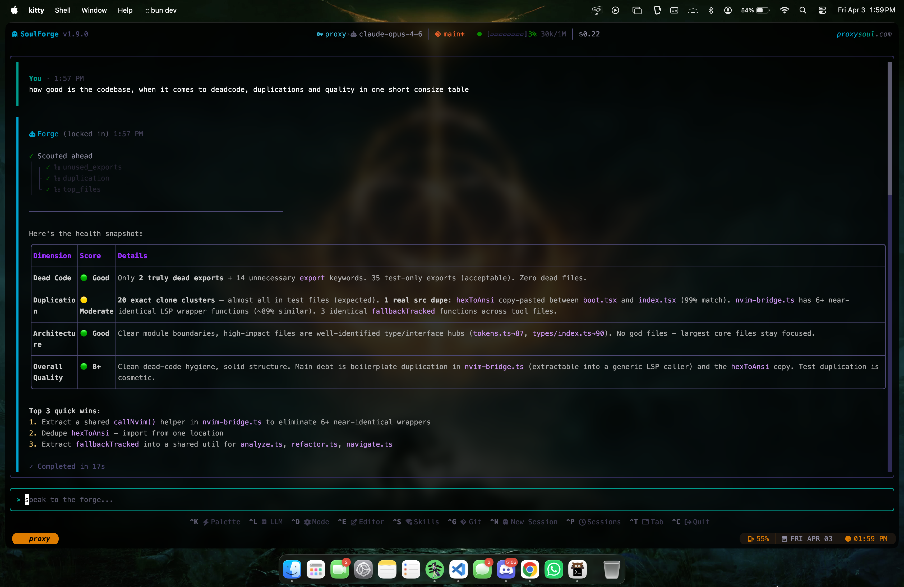

<div align="center">

<picture>
  <source media="(prefers-color-scheme: dark)" srcset="assets/header-dark.svg" />
  <source media="(prefers-color-scheme: light)" srcset="assets/header-light.svg" />
  
</picture>

<br/>

<a href="https://www.npmjs.com/package/@proxysoul/soulforge"><picture><source media="(prefers-color-scheme: dark)" srcset="https://img.shields.io/npm/v/@proxysoul/soulforge?label=version&color=7844f0&style=flat-square&labelColor=0a0818" /><source media="(prefers-color-scheme: light)" srcset="https://img.shields.io/npm/v/@proxysoul/soulforge?label=version&color=7844f0&style=flat-square" /></picture></a>&nbsp;
<a href="LICENSE"><picture><source media="(prefers-color-scheme: dark)" srcset="https://img.shields.io/badge/License-BSL%201.1-ff0059.svg?style=flat-square&labelColor=0a0818" /><source media="(prefers-color-scheme: light)" srcset="https://img.shields.io/badge/License-BSL%201.1-ff0059.svg?style=flat-square" /></picture></a>&nbsp;
<a href="https://github.com/ProxySoul/soulforge/actions/workflows/ci.yml"><picture><source media="(prefers-color-scheme: dark)" srcset="https://img.shields.io/github/actions/workflow/status/ProxySoul/soulforge/ci.yml?label=CI&style=flat-square&color=0b8b00&labelColor=0a0818" /><source media="(prefers-color-scheme: light)" srcset="https://img.shields.io/github/actions/workflow/status/ProxySoul/soulforge/ci.yml?label=CI&style=flat-square&color=0b8b00" /></picture></a>&nbsp;
<a href="https://github.com/ProxySoul/soulforge/actions/workflows/playground.yml"><picture><source media="(prefers-color-scheme: dark)" srcset="https://img.shields.io/github/actions/workflow/status/ProxySoul/soulforge/headless-forge.yml?label=Soul&style=flat-square&color=9b6af5&labelColor=0a0818" /><source media="(prefers-color-scheme: light)" srcset="https://img.shields.io/github/actions/workflow/status/ProxySoul/soulforge/headless-forge.yml?label=Soul&style=flat-square&color=9b6af5" /></picture></a>&nbsp;
<a href="https://www.typescriptlang.org/"><picture><source media="(prefers-color-scheme: dark)" srcset="https://img.shields.io/badge/TypeScript-strict-00a2ce.svg?style=flat-square&labelColor=0a0818" /><source media="(prefers-color-scheme: light)" srcset="https://img.shields.io/badge/TypeScript-strict-00a2ce.svg?style=flat-square" /></picture></a>&nbsp;
<a href="https://bun.sh"><picture><source media="(prefers-color-scheme: dark)" srcset="https://img.shields.io/badge/runtime-Bun-ff0059.svg?style=flat-square&labelColor=0a0818" /><source media="(prefers-color-scheme: light)" srcset="https://img.shields.io/badge/runtime-Bun-ff0059.svg?style=flat-square" /></picture></a>&nbsp;
<a href="https://paypal.me/waeru"><picture><source media="(prefers-color-scheme: dark)" srcset="https://img.shields.io/badge/Fuel_the_Forge-PayPal-9b6af5.svg?style=flat-square&logo=paypal&logoColor=white&labelColor=0a0818" /><source media="(prefers-color-scheme: light)" srcset="https://img.shields.io/badge/Fuel_the_Forge-PayPal-7844f0.svg?style=flat-square&logo=paypal&logoColor=white" /></picture></a>

<br/><br/>


<br/>


</div>


## Why SoulForge?

Every AI coding tool starts blind. It reads files, greps around, slowly pieces together what your codebase looks like. You pay for the agent to learn what you already know.

SoulForge builds a **live dependency graph** on startup. Every file, symbol, import, and export, ranked by importance, enriched with git history, updated as files change. The agent knows which files matter, what depends on what, and how far an edit ripples. It doesn't explore. It works.


### How it saves 30-50% on API costs

<!-- two-column card layout -->
<table>
<tr>
<td width="50%" valign="top">

**[Live Soul Map](docs/repo-map.md)**

SQLite graph of every file, symbol, import, export. PageRank ranking, git co-change history, real-time updates. The agent knows where everything is. No wasted tokens orienting.

</td>
<td width="50%" valign="top">

**[Surgical reads](docs/architecture.md)**

Extracts the exact function or class by name via LSP / ts-morph / tree-sitter / regex across 30 languages. A 500-line file becomes 20 lines.

</td>
</tr>
<tr>
<td valign="top">

**[Zero-cost compaction](docs/compaction.md)**

State extraction runs live: files touched, decisions made, errors hit. When context gets long, compaction is instant from pre-built state. No LLM call.

</td>
<td valign="top">

**[Multi-agent dispatch](docs/agent-bus.md)**

Parallel explore, code, and web search agents. First read caches the file; others get a compact stub. Edit coordination prevents conflicts.

</td>
</tr>
<tr>
<td valign="top">

**[Multi-tab](docs/cross-tab-coordination.md)**

Concurrent sessions, per-tab models and modes. Agents see cross-tab edits, get warnings on contested files, git ops coordinate automatically.

</td>
<td valign="top">

**[Compound tools](docs/compound-tools.md)**

`read` batches parallel + surgical. `multi_edit` atomic. `rename_symbol`, `move_symbol`, `rename_file` compiler-guaranteed cross-file. `project` auto-detects 23 ecosystems.

</td>
</tr>
<tr>
<td valign="top">

**Mix-and-match models**

Opus on planning, Sonnet on coding, Haiku on cleanup. Or one model for everything. Task router gives full control.

</td>
<td valign="top">

**Prompt caching**

Soul Map is stable across turns, stays cached. On Anthropic the system prompt costs a fraction of normal.

</td>
</tr>
</table>

<br/>

<details>
<summary><strong>More features</strong></summary>
<br/>

| | |
|:---|:---|
| **Lock-in mode** | Hides narration, shows only tool activity and final answer. `/lock-in` or config. |
| **Embedded Neovim** | Your config, plugins, LSP servers. The AI works through the same editor you use. [More](docs/architecture.md) |
| **18 providers** | Anthropic, OpenAI, Google, xAI, Groq, DeepSeek, Mistral, Bedrock, Fireworks, Copilot, GitHub Models, Ollama, LM Studio, OpenRouter, LLM Gateway, Vercel AI Gateway, Proxy, any OpenAI-compatible. |
| **Task router** | Per-job model assignment. Spark agents and ember agents each get their own model. [More](docs/architecture.md) |
| **Code execution** | Sandboxed Python via Anthropic's `code_execution` tool. Process data, calculations, batch tool calls. |
| **User steering** | Type while the agent works. Messages queue and arrive at the next step. [More](docs/steering.md) |
| **Skills + gates** | Installable skills for domain work. Destructive actions need confirmation. Auto mode for full autonomy. |
| **4-tier intelligence** | LSP, ts-morph, tree-sitter, regex. 30 languages. Dual LSP: Neovim bridge or standalone. [More](docs/architecture.md) |

</details>

<br/>

<div align="center">
  
</div>


## How it compares

| | SoulForge | Claude Code | Copilot CLI | Codex CLI | Aider |
|:---|:---|:---|:---|:---|:---|
| **Codebase awareness** | Live SQLite graph: PageRank, blast radius, cochange, clone detection, FTS5, unused exports | File reads + grep | None | MCP plugins | Tree-sitter + PageRank |
| **Cost optimization** | Soul Map + surgical reads + zero-cost compaction + shared cache + model mixing + prompt caching | Auto-compaction | Context window mgmt | Server-side compaction | - |
| **Code intelligence** | 4-tier: LSP / ts-morph / tree-sitter / regex. Dual LSP. 30 langs | LSP via plugins | LSP (VS Code) | MCP-based LSP | Tree-sitter AST |
| **Multi-agent** | Parallel dispatch, shared file/tool cache, edit coordination | Subagents + Teams | Subagents + Fleet | Multi-agent v2 | Single |
| **Multi-tab** | Per-tab models, file claims, cross-tab git coordination | - | - | - | - |
| **Task routing** | Per-task model (spark, ember, web search, verify, desloppify, compact) | Single model | Single model | Per-agent model | Single model |
| **Compound tools** | `read` batch+surgical, `multi_edit` atomic, `rename_symbol`, `move_symbol`, `refactor`, `project` | Rename via LSP | - | - | - |
| **Editor** | Embedded Neovim (your config, your plugins) | No | No | No | No |
| **Providers** | 18 + custom OpenAI-compatible | Anthropic only | Multi-model | OpenAI only | 100+ LLMs |
| **License** | BSL 1.1 | Proprietary | Proprietary | Apache 2.0 | Apache 2.0 |

<sub>Verified March 29, 2026. <a href="https://github.com/ProxySoul/soulforge/issues">Report inaccuracies.</a></sub>


## Installation

macOS and Linux. First launch checks for prerequisites and offers to install Neovim and Nerd Fonts.

### Homebrew (recommended)

```bash
brew tap proxysoul/tap
brew install soulforge
```

<details>
<summary><strong>Bun (global)</strong></summary>
<br/>

```bash
curl -fsSL https://bun.sh/install | bash
bun install -g @proxysoul/soulforge
soulforge
```

</details>

<details>
<summary><strong>Prebuilt binary</strong></summary>
<br/>

Download from [Releases](https://github.com/ProxySoul/soulforge/releases/latest):

```bash
tar xzf soulforge-*.tar.gz && cd soulforge-*/ && ./install.sh
```

Installs to `~/.soulforge/`, adds to PATH.

</details>

<details>
<summary><strong>Self-contained bundle</strong></summary>
<br/>

Ships Neovim 0.11, ripgrep, fd, lazygit, tree-sitter grammars, Nerd Font symbols. Zero system deps.

```bash
git clone https://github.com/ProxySoul/soulforge.git && cd soulforge && bun install
./scripts/bundle.sh              # macOS ARM64
./scripts/bundle.sh x64          # Intel Mac
./scripts/bundle.sh x64 linux    # Linux x64
./scripts/bundle.sh x64-baseline linux  # Linux x64 (older CPUs)
./scripts/bundle.sh arm64 linux  # Linux ARM64
cd dist/bundle/soulforge-*/ && ./install.sh
```

</details>

<details>
<summary><strong>Build from source</strong></summary>
<br/>

Requires [Bun](https://bun.sh) >= 1.0 and [Neovim](https://neovim.io) >= 0.11.

```bash
git clone https://github.com/ProxySoul/soulforge.git && cd soulforge && bun install
bun run dev          # development mode
# or
bun run build && bun link && soulforge
```

</details>

### Quick start

```bash
soulforge                                  # launch, pick a model with Ctrl+L
soulforge --set-key anthropic sk-ant-...   # save a key
soulforge --headless "your prompt here"    # non-interactive
```

See [GETTING_STARTED.md](GETTING_STARTED.md) for a full walkthrough.


## Usage

```bash
soulforge                                    # TUI
soulforge --headless "prompt"               # stream to stdout
soulforge --headless --json "prompt"        # structured JSON
soulforge --headless --chat                 # multi-turn
soulforge --headless --model provider/model # override model
soulforge --headless --mode architect       # read-only
soulforge --headless --diff "fix the bug"   # show changed files
```

| Mode | What it does |
|:---|:---|
| `default` | Full agent, all tools |
| `auto` | Executes immediately, no questions |
| `architect` | Read-only analysis and review |
| `socratic` | Guided learning through questions |
| `challenge` | Pushes back on assumptions |
| `plan` | Planning only, no code changes |

[Full CLI reference](docs/headless.md)


## Providers

<table>
<tr><td width="50%" valign="top">

| Provider | Setup |
|:---|:---|
| [**LLM Gateway**](https://llmgateway.io/?ref=6tjJR2H3X4E9RmVQiQwK) | `LLM_GATEWAY_API_KEY` |
| [**Anthropic**](https://console.anthropic.com/) | `ANTHROPIC_API_KEY` |
| [**OpenAI**](https://platform.openai.com/) | `OPENAI_API_KEY` |
| [**Google**](https://aistudio.google.com/) | `GOOGLE_GENERATIVE_AI_API_KEY` |
| [**xAI**](https://console.x.ai/) | `XAI_API_KEY` |
| [**Groq**](https://console.groq.com/) | `GROQ_API_KEY` |
| [**DeepSeek**](https://platform.deepseek.com/) | `DEEPSEEK_API_KEY` |
| [**Mistral**](https://console.mistral.ai/) | `MISTRAL_API_KEY` |
| [**Fireworks**](https://fireworks.ai/) | `FIREWORKS_API_KEY` |

</td>
<td width="50%" valign="top">

| Provider | Setup |
|:---|:---|
| [**Amazon Bedrock**](https://aws.amazon.com/bedrock/) | `AWS_ACCESS_KEY_ID` + `AWS_SECRET_ACCESS_KEY` + `AWS_REGION` |
| [**GitHub Copilot**](https://github.com/features/copilot) | OAuth token ([setup](docs/copilot-provider.md)) |
| [**GitHub Models**](https://github.com/marketplace/models) | `GITHUB_MODELS_API_KEY` |
| [**Ollama**](https://ollama.ai) | Auto-detected |
| [**LM Studio**](https://lmstudio.ai) | Auto-detected |
| [**OpenRouter**](https://openrouter.ai) | `OPENROUTER_API_KEY` |
| [**Vercel AI Gateway**](https://vercel.com/ai-gateway) | `AI_GATEWAY_API_KEY` |
| [**Proxy**](https://github.com/router-for-me/CLIProxyAPI) | `PROXY_API_KEY` |
| **Custom** | Any OpenAI-compatible API |

</td>
</tr>
</table>

<details>
<summary><strong>Provider notes</strong></summary>
<br/>

**Amazon Bedrock** uses AWS IAM credentials. Set `AWS_ACCESS_KEY_ID`, `AWS_SECRET_ACCESS_KEY`, `AWS_REGION` (defaults `us-east-1`). Supports `AWS_SESSION_TOKEN` for temporary creds.

**GitHub Copilot**: sign in via IDE, copy `oauth_token` from `~/.config/github-copilot/apps.json`, save with `/keys` or `--set-key copilot`. [Full guide](docs/copilot-provider.md).

**GitHub Models**: free playground API, per-token billing. Fine-grained PAT with `models:read`. Lower rate limits than Copilot.

**Ollama**: auto-detected at `localhost:11434`. Override with `OLLAMA_HOST`.

**LM Studio**: auto-detected at `localhost:1234`. Override with `LM_STUDIO_URL`. Optional auth via `LM_API_TOKEN`.

</details>

Custom providers via config:

```json
{
  "providers": [{
    "id": "my-provider",
    "name": "My Provider",
    "baseURL": "https://api.example.com/v1",
    "envVar": "MY_PROVIDER_API_KEY",
    "models": ["model-a", "model-b"]
  }]
}
```

[Custom providers](docs/headless.md#custom-providers) / [Provider options](docs/provider-options.md)


## Configuration

Layered: global (`~/.soulforge/config.json`) + project (`.soulforge/config.json`).

```json
{
  "defaultModel": "anthropic/claude-sonnet-4-6",
  "thinking": { "mode": "adaptive" },
  "repoMap": true,
  "taskRouter": {
    "spark": "anthropic/claude-sonnet-4-6",
    "ember": "anthropic/claude-opus-4-6",
    "webSearch": "anthropic/claude-haiku-4-5",
    "desloppify": "anthropic/claude-haiku-4-5",
    "compact": "google/gemini-2.0-flash"
  },
  "instructionFiles": ["soulforge", "claude", "cursorrules"]
}
```

Drop a `SOULFORGE.md` in your project root for conventions, architecture notes, preferences. Also reads `CLAUDE.md`, `.cursorrules`, `AGENTS.md`. Toggle via `/instructions`.

See [GETTING_STARTED.md](GETTING_STARTED.md) for the full config reference.


## Documentation

<table>
<tr><td width="50%" valign="top">

**Core**

| | |
|:---|:---|
| [Architecture](docs/architecture.md) | System overview, intelligence router, agent system |
| [Repo Map](docs/repo-map.md) | PageRank, cochange, blast radius, clone detection |
| [Agent Bus](docs/agent-bus.md) | Multi-agent coordination, shared cache |
| [Compaction](docs/compaction.md) | Context management, state extraction |

**Tools**

| | |
|:---|:---|
| [Compound Tools](docs/compound-tools.md) | read, multi_edit, rename_symbol, move_symbol |
| [Project Tool](docs/project-tool.md) | 23 ecosystems, pre-commit, monorepo |
| [Commands](docs/commands-reference.md) | All 86 slash commands |

</td>
<td width="50%" valign="top">

**Usage**

| | |
|:---|:---|
| [Headless Mode](docs/headless.md) | CLI flags, JSON output, CI/CD |
| [Steering](docs/steering.md) | Mid-stream user input |
| [Cross-Tab](docs/cross-tab-coordination.md) | Multi-tab file claims, git coordination |

**Config**

| | |
|:---|:---|
| [Provider Options](docs/provider-options.md) | Thinking modes, context management |
| [Themes](docs/themes.md) | 24 themes, custom themes, hot reload |
| [Prompt System](docs/prompt-system.md) | Per-family prompts, mode overlays |
| [Copilot Provider](docs/copilot-provider.md) | Setup, legal review |
| [Getting Started](GETTING_STARTED.md) | First launch walkthrough |
| [Contributing](CONTRIBUTING.md) | Dev setup, PR guidelines |

</td>
</tr>
</table>


## Roadmap

Extracting the intelligence layer into reusable packages:

- **`@soulforge/intelligence`** : graph intelligence, tools, agent orchestration as a library
- **`@soulforge/mcp`** : Soul Map tools as MCP servers for Claude Code, Cursor, Copilot, any MCP client
- **`sf --headless`** : shipped. [Docs](docs/headless.md)

| | |
|:---|:---|
| **In progress** | MCP support, repo map visualization, GitHub CLI integration, dispatch worktrees, [ACP](https://agentclientprotocol.com/) |
| **Planned** | Monorepo graph support, benchmarks, orchestrated workflows (planner > TDD > reviewer > security) |


## Inspirations

- **[Aider](https://github.com/Aider-AI/aider)** : tree-sitter repo maps with PageRank. SoulForge adds cochange, blast radius, clone detection, live updates.
- **[Everything Claude Code](https://github.com/affaan-m/everything-claude-code)** : enforce behavior with code, not prompts.
- **[Vercel AI SDK](https://sdk.vercel.ai)** : multi-provider abstraction.
- **[Neovim](https://neovim.io)** : embedded via msgpack-RPC. Your config and muscle memory intact.


## License

[Business Source License 1.1](LICENSE). Free for personal and internal use. Commercial use requires a [commercial license](COMMERCIAL_LICENSE.md). Converts to Apache 2.0 on March 15, 2030.

<br/>

<div align="center">
<sub>Built by <a href="https://github.com/proxysoul">proxySoul</a></sub>
</div>